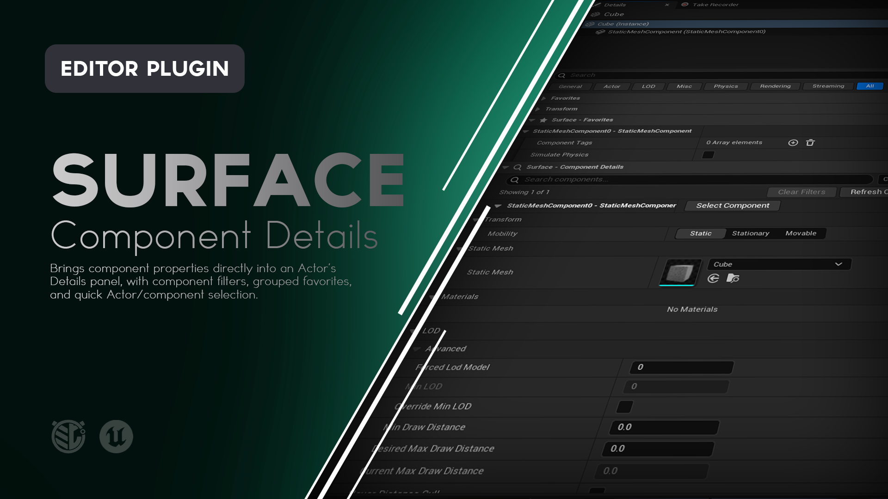
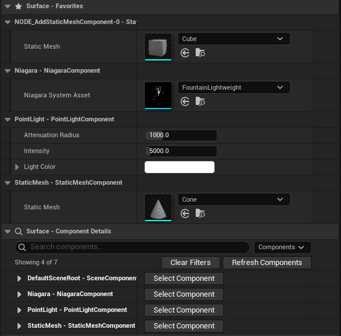

# Surface

**Edit component properties directly from an Actor's Details panel in Unreal Engine.**

Surface brings an Actor's component properties together into its main Details panel, with component filtering, favorites, persistent UI preferences, and quick navigation between Actors and Components.

Spend less time selecting individual Components just to find the property you need.




---

## What is Surface?

An Unreal Actor can contain many Components, and each Component may expose dozens of properties.

Normally, working with those properties means repeatedly moving between the Actor and individual Components.

Surface brings those Component properties directly into the Actor's Details panel.

Instead of:

```text
Select Actor
↓
Select Component
↓
Edit property
↓
Select Actor again
↓
Select another Component
↓
Edit another property
```

Surface gives you:

```text
Actor Details
├── Transform
├── Surface - Favorites
└── Surface - Component Details
    ├── StaticMesh - StaticMeshComponent
    ├── PointLight - PointLightComponent
    ├── Audio - AudioComponent
    └── Collision - BoxComponent
```

Each Component can be expanded independently and edited using Unreal Engine's normal property controls.

When you need the Component's dedicated workflow, **Select Component** takes you directly to it.

When you're finished, **Select Actor** takes you back.

---

# Features

### Component Properties in Actor Details

View and edit owned Component properties without leaving the Actor's main Details panel.

### Individual Component Sections

Each Component receives its own expandable section showing its name and class.

For example:

```text
PointLight - PointLightComponent
```

### Native Property Editing

Surface preserves supported Unreal Engine property behavior, including:

- Categories
- Arrays
- Structs
- Edit conditions
- Multiple-value indicators
- Transactions
- Undo and Redo
- Reset to Default
- Supported property customizations

### Component Search

Filter displayed Components by Component name or class.

### Component Visibility Filters

Choose exactly which Components Surface displays.

### Check All / Uncheck All

Quickly enable or disable every available Component.

### Clear Filters

Remove the current search and show all available Components.

### Showing X of Y

See how many Components currently pass your search and visibility filters.

### Refresh Components

Rebuild Surface's available Component list after scripts or unusual editor operations modify Component membership.

### Surface Favorites

Collect favorite Component properties into a dedicated:

**Surface - Favorites**

section at the Actor level.

### Favorites Grouped by Component

Favorite properties remain organized beneath the Component they belong to.

### Favorites Ignore Component Filters

Favorite properties remain accessible even if their Component is currently filtered out of Surface - Component Details.

### Quick Component Selection

Use **Select Component** to jump from an embedded Component section to that Component's normal Details workflow.

### Quick Actor Selection

When a Component is selected, Surface provides **Select Actor** to return to its owning Actor.

### Multi-Selection Support

Edit matching Components across multiple instances of the same Actor class.

### Persistent Filters

Component search and visibility choices persist between editor sessions.

### Persistent Expansion States

Surface remembers:

- Surface - Favorites expansion
- Surface - Component Details expansion
- Individual Component expansion

### Per-Selection Preferences

Different Actors and Actor selections can maintain their own Surface layout and filter preferences.

### Editor Only

Surface does not add runtime Actors, Components, or gameplay systems.

---

> [!IMPORTANT]
> **ATTENTION - README AUTHOR**
>
> Capture the main Surface workflow here.
>
> **Recommended visual:** GIF
>
> Use an Actor with at least 5 Components.
>
> Show:
>
> 1. Select the Actor.
> 2. Expand **Surface - Component Details**.
> 3. Expand one Component.
> 4. Edit a visible property.
> 5. Search for another Component by name or class.
> 6. Expand that Component.
> 7. Edit another property.
> 8. Clear the filter.
>
> Keep both the World Outliner and Details panel visible, but make the Details panel large enough that the controls are easy to read.
>
> Around 8 to 12 seconds is ideal.
>
> **Suggested file:**
>
> `Doc/Images/Surface-Component-Details.gif`
>
> Once captured, replace this callout with:
>
> ```markdown
> 
> ```

---

# Using Surface

Select a placed Actor in your level.

Surface adds two categories to its Details panel:

```text
Surface - Favorites
Surface - Component Details
```

When Unreal's normal Transform category is available, Surface places these sections directly beneath it.

---

# Surface - Component Details

Expand:

**Surface - Component Details**

to access the Actor's Components.

Each available Component receives a header formatted as:

```text
ComponentName - ComponentClassName
```

For example:

```text
Mesh - StaticMeshComponent

PointLight - PointLightComponent

Collision - BoxComponent
```

Expand a Component header to expose its properties.

Surface uses Unreal Engine's existing property editing system, so these properties behave much like they would in the Component's normal Details panel.

---

# Selecting a Component

Each Component header includes:

**Select Component**

Click it to select that Component normally.

This is useful when you need Component-specific workflows that are better suited to the normal Component Details panel or viewport.

Examples might include:

- Component-specific viewport editing
- Specialized Component tools
- Custom Component Details interfaces

---

# Returning to the Actor

When a Component is selected directly, Surface adds a compact section containing information about the owning Actor.

This includes:

```text
ActorName - ActorClass
```

and:

**Select Actor**

Click **Select Actor** to return to the owning Actor's Details panel.

This creates a simple navigation loop:

```text
Actor
↓
Select Component
↓
Component
↓
Select Actor
↓
Actor
```

> [!IMPORTANT]
> **ATTENTION - README AUTHOR**
>
> Capture Actor and Component navigation here.
>
> **Recommended visual:** GIF
>
> Show:
>
> 1. An Actor selected.
> 2. Expand one Component inside Surface.
> 3. Click **Select Component**.
> 4. Show the Component's normal Details panel.
> 5. Click **Select Actor**.
> 6. Return to the Actor's Surface panel.
>
> This can be short, around 5 to 8 seconds.
>
> **Suggested file:**
>
> `Doc/Images/Surface-Selection.gif`
>
> Once captured, replace this callout with:
>
> ```markdown
> 
> ```

---

# Component Filtering

Actors can contain many Components, and showing all of them at once is not always useful.

Surface provides two filters that work together:

1. **Search**
2. **Component visibility**

A Component must pass both filters to appear in Surface - Component Details.

---

## Search Components

Use:

**Search components...**

to filter by Component name or class.

For example:

```text
light
```

might match:

```text
PointLight - PointLightComponent
SpotLight - SpotLightComponent
```

while:

```text
collision
```

might match a Component named:

```text
CollisionVolume
```

Search does not change which Components are enabled in the Component menu.

It temporarily narrows what is displayed.

---

# Components Menu

Open the **Components** menu to choose which Components Surface displays.

Every available Component receives a checkbox.

### Checked

The Component can appear when it also passes the search filter.

### Unchecked

The Component is hidden from Surface - Component Details.

It remains part of the Actor and can still be accessed normally.

---

## Check All

**Check All** enables every available Component.

This includes Components that Surface may not have displayed by default.

The current search text is preserved.

---

## Uncheck All

**Uncheck All** hides every Component from Surface - Component Details.

Surface - Favorites remains available.

---

## Clear Filters

**Clear Filters**:

- Clears the search
- Enables every available Component
- Preserves Component expansion choices

The button is disabled when there is nothing to clear.

---

## Showing X of Y

Surface displays a Component count such as:

```text
Showing 3 of 8
```

This tells you how many Components currently pass both the search and checkbox filters.

---

# Default Component Visibility

When Surface encounters a Component for the first time, it tries to follow Unreal Engine's normal level-instance Component visibility rules.

Some helper or implementation Components may therefore begin hidden from Surface - Component Details.

Those Components are still available from the **Components** menu.

You can explicitly enable them at any time.

The Actor's root Component is included by default.

Once you make a visibility choice, Surface remembers it for that Actor selection.

---

# Refresh Components

Most normal Component changes are detected automatically.

If a script or unusual editor operation adds, removes, or reconstructs Components without causing the expected Details refresh, click:

**Refresh Components**

Surface rebuilds its Component list while retaining saved preferences for Component identities it still recognizes.

You generally do not need to use Refresh Components during normal property editing.

---

# Surface - Favorites

Surface includes a dedicated favorites category:

**Surface - Favorites**

Right-click a Component property and use Unreal Engine's normal favorite action.

Surface collects favorite Component properties and displays them here, grouped by Component.

For example:

```text
Surface - Favorites

PointLight - PointLightComponent
├── Intensity
├── Light Color
└── Attenuation Radius

Mesh - StaticMeshComponent
├── Static Mesh
└── Visible
```

This gives frequently edited Component properties a permanent location near the top of the Actor Details panel.

> [!IMPORTANT]
> **ATTENTION - README AUTHOR**
>
> Capture Surface Favorites here.
>
> **Recommended visual:** Screenshot
>
> Use an Actor with at least 3 Components.
>
> Favorite several useful properties across those Components.
>
> Show:
>
> **Surface - Favorites**
>
> expanded with the properties grouped beneath their Component names.
>
> Also keep **Surface - Component Details** visible below it so the relationship between the two sections is clear.
>
> **Suggested file:**
>
> `Doc/Images/Surface-Favorites.png`
>
> Once captured, replace this callout with:
>
> ```markdown
> 
> ```

---

# Favorites and Filters

Favorites remain visible even when:

- Their Component is unchecked
- Their Component does not match the current search
- Their Component Details section is collapsed

This allows Surface - Favorites to act as a compact collection of the Component properties you care about most.

---

# Favorite Behavior

Surface uses Unreal Engine's existing property favorite system.

Favorites generally apply according to the Component class and property.

For example, if an Actor contains three Point Light Components and you favorite:

```text
Light Color
```

Surface may display Light Color for all applicable Point Light Components.

Each property still edits its own Component independently.

Favoriting the property does not link their values together.

> [!NOTE]
> Unreal Engine's Details Favorites feature must be enabled for Surface to collect and display favorite Component properties.

---

# Multi-Selection

Surface supports editing multiple instances of the same exact Actor class.

This includes multiple instances of the same Blueprint class.

For example:

```text
BP_Lamp_01
BP_Lamp_02
BP_Lamp_03
```

If all three are instances of:

```text
BP_Lamp
```

Surface can match corresponding Components across the selection.

A displayed Component group represents one corresponding Component from every selected Actor.

---

## Matching Components

Surface matches Components using:

- Relative object path
- Exact Component class
- Component creation method

Surface does not simply assume that two Components match because they share the same type or happen to occupy the same array position.

For example:

```text
BP_Lamp_01
└── PointLight

BP_Lamp_02
└── PointLight
```

can form a matching Component group when their identity and construction match.

Editing a property then uses Unreal Engine's normal multi-object property editing behavior.

If values differ, Unreal's normal multiple-value presentation is used.

---

## Unmatched Components

If one selected Actor contains a Component that does not have a valid counterpart on every selected Actor, Surface omits that Component from the shared group and displays a notice.

Select the individual Actor if you need to edit that unmatched Component.

Components added independently to individual Actor instances or generated with inconsistent names can prevent matching.

---

> [!IMPORTANT]
> **ATTENTION - README AUTHOR**
>
> Capture multi-selection here.
>
> **Recommended visual:** Screenshot or short GIF
>
> Use several instances of the same Blueprint Actor.
>
> Show:
>
> 1. Multiple instances selected in the World Outliner.
> 2. Surface - Component Details showing shared matching Components.
> 3. One property displaying Unreal's normal multiple-value state.
> 4. Change the property so the selected Actors update together.
>
> A GIF is useful if the change is visually obvious in the viewport. Otherwise, a screenshot is enough.
>
> **Suggested file:**
>
> `Doc/Images/Surface-Multi-Selection.gif`
>
> Once captured, replace this callout with:
>
> ```markdown
> 
> ```

---

# Saved Preferences

Surface remembers how you prefer to work with each Actor selection.

Saved preferences include:

- Component search text
- Component checkbox visibility
- Individual Component expansion states
- Surface - Favorites expansion
- Surface - Component Details expansion

These preferences persist between Unreal Editor sessions.

---

## Default Layout

A new Actor selection begins with:

**Surface - Favorites**

expanded.

**Surface - Component Details**

collapsed.

Individual Component headers also begin collapsed.

This keeps Surface compact until you need its full Component interface.

---

## Preferences Are Local Editor Settings

Surface UI preferences are stored as local per-project Editor preferences.

They do not modify:

- Actor assets
- Blueprint assets
- Level data
- Component properties
- Packaged games

This means expanding a Component or changing a Surface filter does not dirty your level.

---

## Preferences Follow Selection Identity

Surface stores preferences based on the Actor selection and Component identity.

For example:

```text
Actor_A
```

can have different Surface settings from:

```text
Actor_B
```

and:

```text
Actor_A + Actor_B
```

can have its own multi-selection preferences.

Renaming or recreating Components, moving Actors between levels, or renaming maps can change those identities and cause Surface to treat them as a new selection.

---

# Example Workflow

Imagine a Blueprint Actor containing:

```text
BP_SecurityLight
├── SceneRoot
├── HousingMesh
├── PointLight
├── AudioComponent
├── TriggerVolume
└── InteractionWidget
```

You regularly adjust:

- Point Light intensity
- Point Light color
- Audio volume
- Trigger size
- Widget visibility

Without Surface, you repeatedly move through individual Components.

With Surface:

1. Select `BP_SecurityLight`.
2. Expand **Surface - Component Details**.
3. Hide Components you rarely use.
4. Favorite the properties you adjust constantly.
5. Collapse Component Details.
6. Work primarily from **Surface - Favorites**.
7. Search Component Details whenever you need something less common.
8. Use **Select Component** only when you need a Component-specific workflow.
9. Return with **Select Actor** when finished.

The Actor becomes the main editing surface for the entire assembly.

---

# Installation

Surface can be installed through **Fab**, from a **precompiled GitHub Release**, or directly from the **GitHub source**.

For most users, the Fab or GitHub Release installation is recommended.

---

## Fab / Epic Games Launcher

> **Availability:** Use this installation method once Surface is available through Fab.

1. Add **Surface** to your library on Fab.
2. Open the **Epic Games Launcher**.
3. Navigate to your Unreal Engine Library.
4. Locate Surface in your Fab / Vault library.
5. Install Surface to the supported Unreal Engine version.
6. Launch your Unreal Engine project.
7. Open **Edit > Plugins**.
8. Search for **Surface**.
9. Enable the plugin if it is not already enabled.
10. Restart Unreal Editor if prompted.

Once enabled, select a placed Actor to access Surface in its Details panel.

---

## GitHub Release

This is the easiest GitHub installation method because the release package is already prepared for the supported Unreal Engine version.

### 1. Download Surface

Open the repository's **Releases** page:

https://github.com/mippi-the-dork/Surface/releases

Download the latest packaged plugin matching your Unreal Engine version and platform.

For the current release:

```text
Surface 1.0.4
Unreal Engine 5.8.2
Windows 64-bit
```

Do not use GitHub's automatically generated **Source code** ZIP as a precompiled plugin package.

### 2. Close Unreal Editor

Close the project before installing the plugin.

### 3. Locate Your Project Plugins Folder

Your project should contain a `Plugins` directory beside the `.uproject` file:

```text
YourProject/
├── Config/
├── Content/
├── Plugins/
└── YourProject.uproject
```

If the `Plugins` directory does not exist, create it.

### 4. Extract Surface

Extract the `Surface` folder into:

```text
YourProject/Plugins/
```

The final structure should look similar to:

```text
YourProject/
├── Plugins/
│   └── Surface/
│       ├── Config/
│       ├── Resources/
│       ├── Source/
│       └── Surface.uplugin
└── YourProject.uproject
```

### 5. Launch the Project

Open your Unreal Engine project.

If necessary, navigate to:

**Edit > Plugins**

Search for:

```text
Surface
```

Enable the plugin and restart Unreal Editor if prompted.

---

## GitHub Source

Developers who want the source or want to modify Surface can clone the repository directly.

### Requirements

Building Surface from source requires a working Unreal Engine C++ development environment.

For Windows this generally means:

- Unreal Engine 5.8.x
- Visual Studio with the appropriate C++ workloads
- A project capable of compiling C++ plugins

### Clone the Repository

Close Unreal Editor and navigate to your project's `Plugins` directory.

```bash
cd YourProject/Plugins
git clone https://github.com/mippi-the-dork/Surface.git
```

Your project should now contain:

```text
YourProject/Plugins/Surface/
```

### Generate Project Files

If necessary:

1. Right-click your `.uproject`.
2. Select **Generate Visual Studio project files**.

Then open the generated solution and build your project's Editor target.

For example:

```text
YourProjectEditor
Win64
Development Editor
```

Launch the project after compilation completes.

---

# Updating Surface

## GitHub Release Installation

When updating a manually installed release:

1. Close Unreal Editor.
2. Remove the existing `Plugins/Surface` folder.
3. Extract the new Surface release into the `Plugins` directory.
4. Reopen the project.

Replacing the complete plugin folder is recommended rather than copying individual files over an older version.

Local Surface UI preferences are stored outside the plugin directory and should remain available when upgrading.

---

## Git Source Installation

If you cloned the repository using Git:

```bash
cd YourProject/Plugins/Surface
git pull
```

Rebuild the project if the source has changed.

---

# Compatibility

The current Surface release targets:

| | |
|---|---|
| **Surface Version** | 1.0.4 |
| **Unreal Engine** | 5.8.x |
| **Tested Version** | 5.8.2 |
| **Platform** | Windows 64-bit |
| **Plugin Type** | Editor |
| **Runtime Dependency** | None |
| **Runtime Actors** | None |
| **Runtime Components** | None |
| **Packaged Game Impact** | None |

Surface's plugin descriptor targets Unreal Engine 5.8.0, with the current packaged release built for Unreal Engine 5.8.2 on Windows 64-bit.

Compatibility with additional Unreal Engine versions or platforms should not be assumed unless explicitly listed in a release.

---

# How Surface Works

Surface extends the normal Actor Details customization.

When an Actor is selected:

1. Surface finds the Actor's owned Components.
2. It determines which Components should initially be available.
3. It creates an expandable section for each compatible Component.
4. Unreal Engine generates that Component's normal property layout.
5. Surface embeds those property rows beneath the Component header.
6. Search and checkbox filters determine which Component groups are displayed.
7. Favorite Component properties are collected into Surface - Favorites.
8. Local UI preferences are restored for the current Actor selection.

Surface does not duplicate Component values or maintain a separate editing system.

The properties displayed by Surface still belong to the original Components.

---

# What Surface Does Not Do

Surface is an **editor workflow tool**.

It does not:

- Copy Component properties onto the Actor
- Create duplicate Components
- Change Component ownership
- Change Actor hierarchy
- Add runtime Components
- Add gameplay systems
- Modify packaged-game behavior
- Replace the normal Component Details panel
- Recursively expose Components belonging to attached Actors
- Recursively inspect the Actor created by a Child Actor Component
- Change whether Unreal Engine considers a property editable
- Turn hidden or read-only properties into editable properties

Surface provides another way to reach existing Component properties.

It does not change what those properties mean.

---

# Limitations

### Editor Actors Only

Surface targets placed Actor instances in normal Editor worlds.

It does not target:

- Blueprint Class Defaults
- Blueprint templates
- Preview Actors
- PIE Actors
- Simulation instances

### Child Actor Components

The Child Actor Component itself can appear in Surface.

Surface does not recursively expose the Components belonging to the separate Actor spawned by that Child Actor Component.

### Attached Actors

Surface displays Components owned by the selected Actor.

It does not recursively collect Components from other attached Actors.

### Specialized Component Interfaces

Some Components provide specialized editor tools or custom Details interfaces that may not reproduce perfectly inside Surface's embedded layout.

Use **Select Component** when you need that Component's normal dedicated workflow.

### Component Indentation

Some native Component property categories may appear less indented than the Component header above them.

Those properties still belong to that Component.

### Filtering Is Presentation

Component filtering controls what Surface displays.

It does not prevent Unreal Engine from generating the underlying Component layouts required for editing and favorite collection.

Filtering should therefore be treated as an organization feature rather than a performance optimization for very large Component counts.

### Construction Scripts

Editing a Component property through Surface behaves like editing that property normally.

Changes can:

- Dirty the level
- Trigger construction scripts
- Be replaced by construction-script-authored values

### Multi-Selection Matching

Multi-selection requires corresponding Components to be confidently matched across every selected Actor.

Independently added Components, renamed Components, or construction scripts that generate inconsistent Component names can prevent matching.

---

# Troubleshooting

## Surface Does Not Appear in the Details Panel

Check:

**Edit > Plugins**

Search for:

```text
Surface
```

Confirm that the plugin is enabled.

Restart Unreal Editor if it was just enabled.

Make sure you selected a placed Actor instance rather than a Blueprint Class Default Object or preview Actor.

---

## Surface Appears Near the Bottom of the Details Panel

Surface normally places its categories immediately after a recognized Actor Transform category.

If the current Details view does not expose a recognized Transform category, Surface uses fallback sort positions and may appear lower in the panel.

---

## A Component Is Missing

Open the **Components** menu.

The Component may be available but unchecked by default.

You can:

- Enable it individually
- Use **Check All**
- Use **Clear Filters**

If Components were recently added or removed through scripting or an unusual editor workflow, click:

**Refresh Components**

---

## Search Finds Nothing

Search checks Component names and Component classes.

Also make sure the desired Component remains checked in the **Components** menu.

A Component must pass both filters to appear.

---

## Clear Filters Did Not Restore the Original Default Visibility

This is expected.

**Clear Filters** shows every available Component.

It does not reset the Actor to Surface's original first-time visibility choices.

Surface remembers your visibility preferences after you change them.

---

## Favorites Do Not Appear

Make sure Unreal Engine's Details Favorites functionality is enabled.

Then right-click a compatible Component property and use Unreal's normal favorite action.

The property should appear under:

**Surface - Favorites**

---

## A Favorite Appears for Multiple Components

Favorites follow Unreal Engine's Component class and property favorite behavior.

Favoriting a property on one Component class can expose that same property for other matching Components of the same class.

The values remain independent.

---

## My Filters Changed After Renaming Something

Surface persistence relies on Actor, level, and Component identity.

Renaming or recreating Components, moving Actors between levels, or renaming maps can produce a new identity.

Surface may therefore treat that Actor or Component as a new selection and use default preferences.

---

## Multi-Selection Is Missing a Component

Surface only displays a shared Component group when it can match one appropriate Component across every selected Actor.

Check whether:

- Every selected Actor is the same exact class
- The Component exists on every Actor
- The Component names and paths match
- The Component classes match
- Their creation methods match

Select an individual Actor to edit Components that do not have valid counterparts across the selection.

---

# Reporting Bugs

If you encounter a problem, please open an issue:

https://github.com/mippi-the-dork/Surface/issues

When reporting a bug, include:

- Surface version
- Unreal Engine version
- Windows version
- Whether Surface was installed from Fab, a GitHub Release, or source
- Actor class involved
- Component class involved
- Whether single-selection or multi-selection was involved
- Whether the issue affects Component Details, filters, favorites, or selection navigation
- Steps to reproduce the problem
- Screenshots or video when relevant
- Any relevant Unreal Editor log output

For layout issues, a screenshot of the complete Details panel is especially useful.

---

# Feature Requests

Suggestions and feature requests are welcome through GitHub Issues.

When proposing a feature, describe the Details-panel or Component-editing workflow problem you're trying to solve rather than only the implementation you would like to see.

That makes it easier to determine whether the feature belongs in Surface and whether there may be a simpler solution.

---

# Contributions

Pull requests are welcome.

If you're considering a significant change, opening an Issue first is recommended so the intended behavior can be discussed before substantial work is done.

Surface is intended to remain focused on making Actor Component properties easier to access and edit.

---

# License

Surface is distributed under the **MIT License**.

See [`LICENSE`](LICENSE) for details.

---

# About

Surface is an Unreal Engine editor utility created by **Mippi the Dork**.

The plugin was built around a simple idea:

> If a Component belongs to an Actor, you should not have to leave the Actor just to work with it.

Surface turns the Actor Details panel into a more complete view of the thing you're actually editing.
